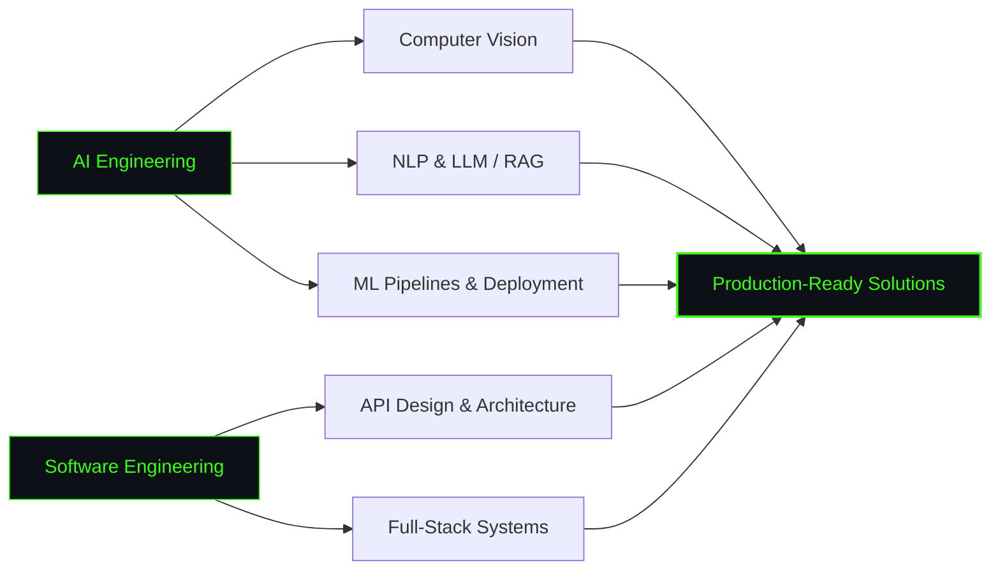

---

### About Me

AI Engineer building production-ready intelligent systems — from data pipelines to deployed deep learning models. I work across the full stack: designing clean APIs, training and shipping ML models, and turning research into real products.

---

### Tech Stack

---

### Focus Areas

---

### GitHub Analytics

---

### Contribution Activity

<picture>
  <source media="(prefers-color-scheme: dark)" srcset="https://raw.githubusercontent.com/Omaryone1w1/Omaryone1w1/output/github-contribution-grid-snake-dark.svg" />
  <source media="(prefers-color-scheme: light)" srcset="https://raw.githubusercontent.com/Omaryone1w1/Omaryone1w1/output/github-contribution-grid-snake.svg" />
  
</picture>

---

### Connect With Me

---

*"Building the future through Artificial Intelligence — one system at a time."*

