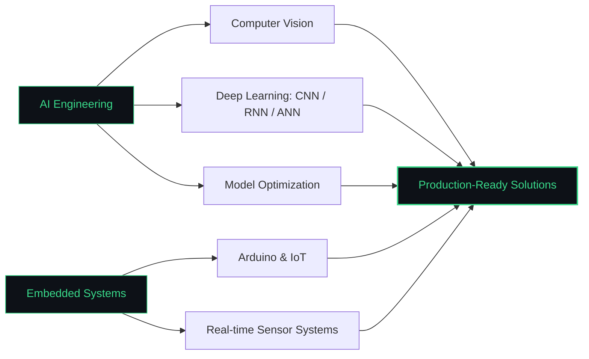

### About Me

AI & Intelligent Systems Engineering student with hands-on experience in Deep Learning, Machine Learning, CNN, RNN, ANN, and IoT projects. I build and debug models from scratch, ship real prototypes, and present results in IEEE workshops and competitions.

### Tech Stack

### Focus Areas

### Experience

### Open to Collaboration

<table align="center">
<tr>
<th>AI & Machine Learning</th>
<th>Embedded Systems & IoT</th>
<th>Software Development</th>
<th>Data Analysis</th>
</tr>
<tr>
<td valign="top">

- Deep Learning (CNN, RNN, ANN)
- Computer Vision & Style Transfer
- Model debugging & optimization

</td>
<td valign="top">

- Arduino & Atmega32 systems
- Sensors, actuators, real-time control
- Smart embedded prototypes

</td>
<td valign="top">

- Python, C/C++, Java
- Clean APIs & system design
- Git-based collaboration

</td>
<td valign="top">

- Pandas, NumPy, Matplotlib
- Exploratory data analysis
- Experiment tracking

</td>
</tr>
</table>

### GitHub Analytics

### Contribution Activity

<picture>
  <source media="(prefers-color-scheme: dark)" srcset="https://raw.githubusercontent.com/Omaryone1w1/Omaryone1w1/output/github-contribution-grid-snake-dark.svg" />
  <source media="(prefers-color-scheme: light)" srcset="https://raw.githubusercontent.com/Omaryone1w1/Omaryone1w1/output/github-contribution-grid-snake.svg" />
  
</picture>

### Connect With Me

*Building the future through Artificial Intelligence — one system at a time.*

