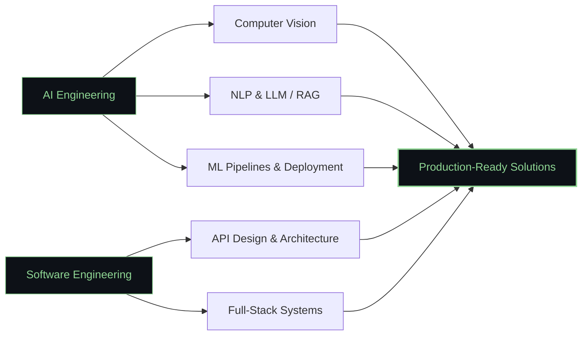
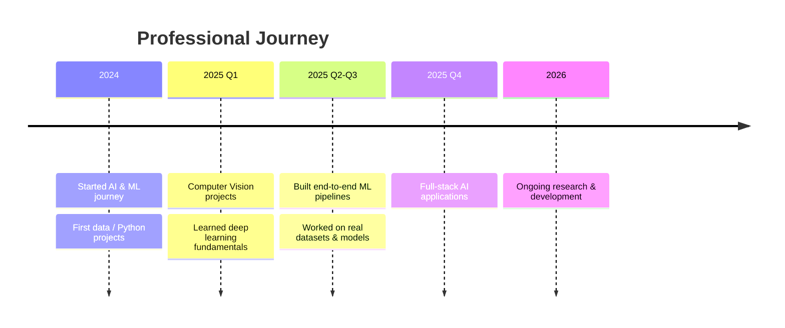

---

### About Me

AI Engineer building production-ready intelligent systems — from data pipelines to deployed deep learning models. I work across the full stack: designing clean APIs, training and shipping ML models, and turning research into real products.

---

### Tech Stack

---

### Focus Areas

---

### Experience

> عدّل السطور دي بالمشاريع والتواريخ الحقيقية بتاعتك — دي مجرد قالب فاضي حالياً.

---

### Open to Collaboration

<table align="center">
<tr>
<td align="center" width="200">

**Software Development**

Full-Stack Applications
API & Microservices
System Architecture

</td>
<td align="center" width="200">

**AI Development**

Computer Vision & NLP
LLM / RAG Applications
ML Pipeline Engineering

</td>
<td align="center" width="200">

**Data Science**

Predictive Modeling
Analytics & Visualization

</td>
</tr>
</table>

---

### GitHub Analytics

---

### Contribution Activity

<picture>
  <source media="(prefers-color-scheme: dark)" srcset="https://raw.githubusercontent.com/Omaryone1w1/Omaryone1w1/output/github-contribution-grid-snake-dark.svg" />
  <source media="(prefers-color-scheme: light)" srcset="https://raw.githubusercontent.com/Omaryone1w1/Omaryone1w1/output/github-contribution-grid-snake.svg" />
  
</picture>

---

### Connect With Me

---

*Building the future through Artificial Intelligence — one system at a time.*

